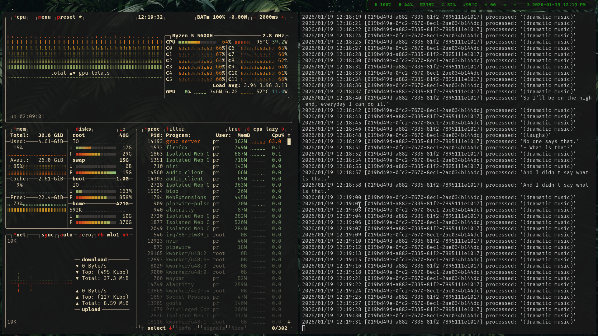
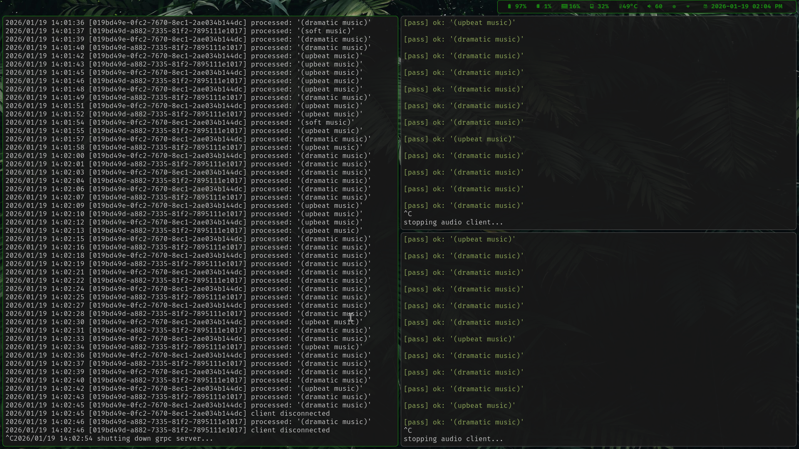

# backend audio transcriber go

a real-time audio transcriber server in golang using audio ml model & leverage protocol buffer with grpc.

<br>

__TL;DR__
```
It all begin when I watch coworker start live streaming in one of the biggest social media platform,
afer a few minutes, they got warning violation notification.

As far as they know, they believed that they don't violate their community rules,
since they also believed their video presentation are appropriate.

After couple attempts, the violation appear again, but now we realized that violation notification appear after they says something.
```

<br>

[quick preview](https://youtu.be/IwSptYtNRzM)

[](https://www.youtube.com/watch?v=IwSptYtNRzM)

<br>

---

idea flow:

1. > client/end-user send the audio -> server check & processing the audio -> send response

2. > if the audio process contain *forbidden* keywords -> do something (warn, err, etc.)

this looks simple, but you know that when we configuring, build, and test our software it required something else in the process

<br>

---

## prequiste

- go core compiler tools:
    - [archlinux pacakge](https://archlinux.org/packages/extra/x86_64/go/)
    - [go dev install doc](https://go.dev/doc/install)

- protoc:
    - [debian package](https://packages.debian.org/trixie/protobuf-compiler)
    - [archlinux pacakge](https://archlinux.org/packages/extra/x86_64/protobuf/)

- protoc-gen-go:
    - `go install google.golang.org/protobuf/cmd/protoc-gen-go@latest`   

- protoc-gen-go-grpc:
    - `go install google.golang.org/grpc/cmd/protoc-gen-go-grpc@latest`

<br>

---

## important

1. run and tested in:

    - go version go1.25.5 X:nodwarf5 linux/amd64
    - base model en is provided through git-lfs, see `./assets/models/ggml-base.en.bin`

2. if `config.audio.json` & `config.grpc.json` doesn't exists, copy and paste those file from .json.template to .json

3. you need to build and expose the library from [whisper](https://github.com/ggml-org/whisper.cpp) and install the model:
    - after the installation, you need to export the include path and include lib directory
    - you may required to export you `LD_LIBRARY_PATH` if you use custom path, i.e.:
    ```sh
    # when you define `-DCMAKE_INSTALL_PREFIX=~/` when build whisper library
    # this will add bin, lib, include, share dir to the home directory after build and install `cmake --install build/path
    export LD_LIBRARY_PATH="$LD_LIBRARY_PATH:$HOME/lib";
    export C_INCLUDE_PATH="$C_INCLUDE_PATH:$HOME/include"
    ```
    
4. use [drun-audio_client.sh](./drun-audio_client.sh) to run the client & use [drun-grpc_server.sh](./drun-grpc_server.sh)
 
5. use proper model and check the forbidden keywords, a base english model from ggml is still capable to detect specific keyword, you also may adjust this as you need, see [whisper model field](./config.audio.json.template#L3) 

<br>

---

## build

1. __local system environment/your pc:*__
    1. build and expose/install whisper library
    2. you can run `./dbuild.sh`, the script is as follow:

--

2. __*docker/podman:*__
    1. build image container is provided, you can run:
        - `./build-image-docker.sh` for docker, or
        - `./build-image-podman.sh` for podman
    2. to run build image in container si provided, you can run:
        - `./run-container-docker.sh` for docker, or
        - `./run-container-podman.sh` for podman
    3. if you want to change the model you can substitue the string of `/llm/ggml-base.en.bin` from `Dockerfile` and create your own custom build/deployment

---

when all goes well, you should see something from the log as below
```
...
YYYY/MM/DD 14:23:43 server running on 0.0.0.0:20202
...
```
that log came from `docker logs -f server-backend-audio_transcriber-go` or `podman logs -f server-backend-audio_transcriber-go`

<br>

---

## overview

### key features

- real-time design
- modular structure
- informative logging
- active buffer checking
- keywords awareness check
- seperate goroutine for send/receive

<br>

---

### trade-off

1. concurrency vs thread safety:
    - paralellism use worker pool
    - since it using whisper library it's not thread-safe using mutex approach

2. latency vs transcription accuracy:
    - both audio_client & grpc_server are collecting ~1 second audio before sent & processed
    - better throughput rather than latency

3. resposiveness vs data lost:
    - audio chanel and request use limited buffer:
        - preferably drop rather than block
        - responsive on high load but audio burst could make grpc server slowdown

<br>

---

### stress test

below is a 2 hour stress test using 12 threads cpu and 32GB of RAM





<br>

---

### extra

`if you had better options/approach, I would love to read/see that` - @prothegee

<br>

---

<!--
seperation concern for larger project:
1. worker & queue:
    - use 1 worker and 1 queue for each
2. use small chunk to send often audio data for `more realtime`
3. monitoring & backpressure handling
4. tight security management
-->

###### end of readme
